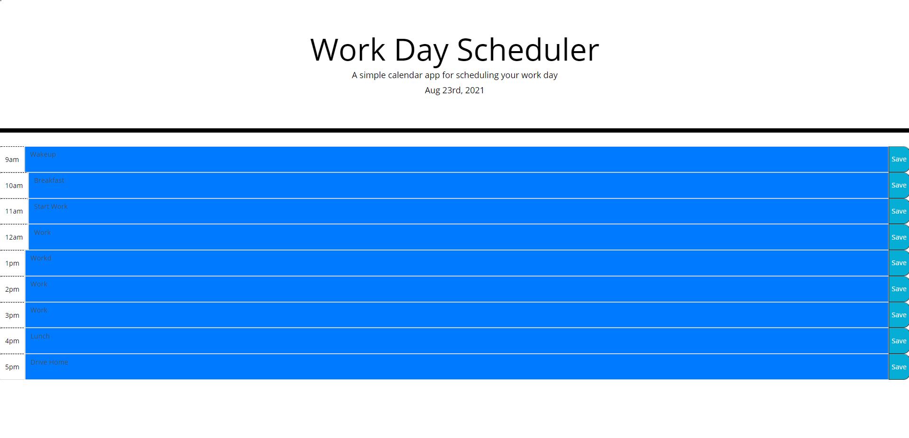

# work-day-scheduler

## Description
This application allows the user to create a schedule for their workday. 

This project provided an opportunity to learn Bootstrap syle applications, jQuery applications, and continue to improve the author's understanding of iterators, arrays, and for loops.

## Usage
To use this scheduler add and entry into one of the text areas. When finished loggin an entry, click on the right-hand 'save' button to save your progress.

## Credits
This project was built using starter code provided in the course material. Most of the html, some of the css, and all of the Javascript was written by the author. 
